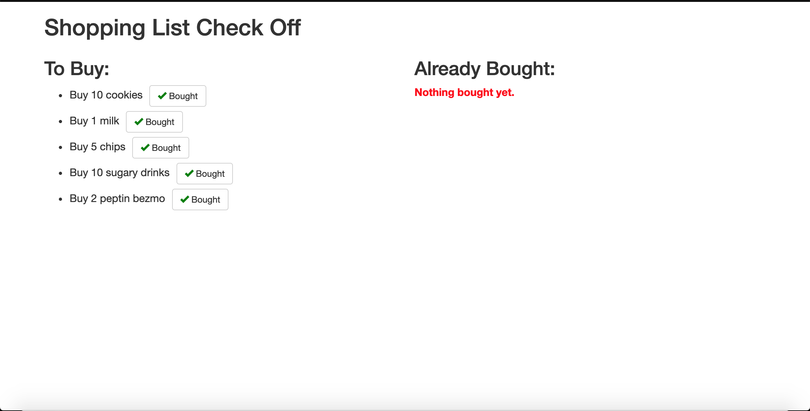
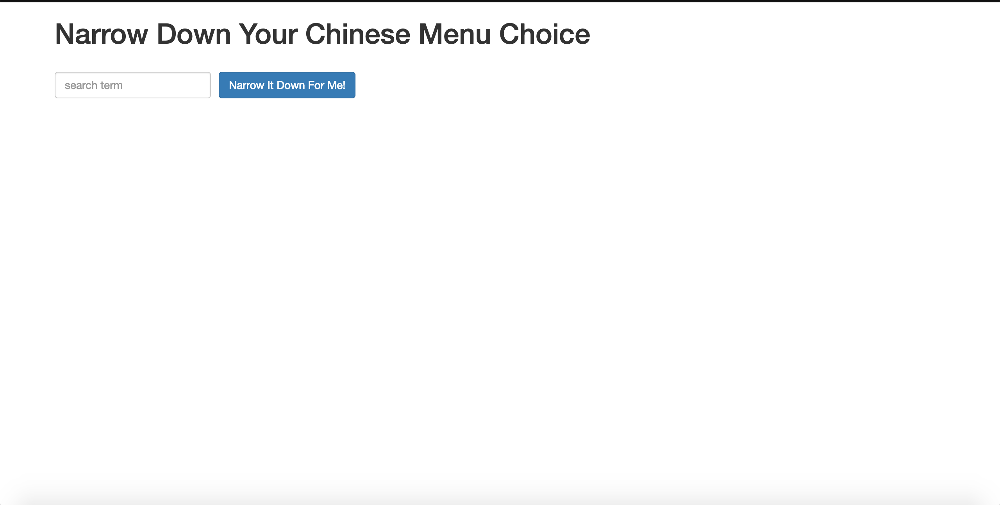
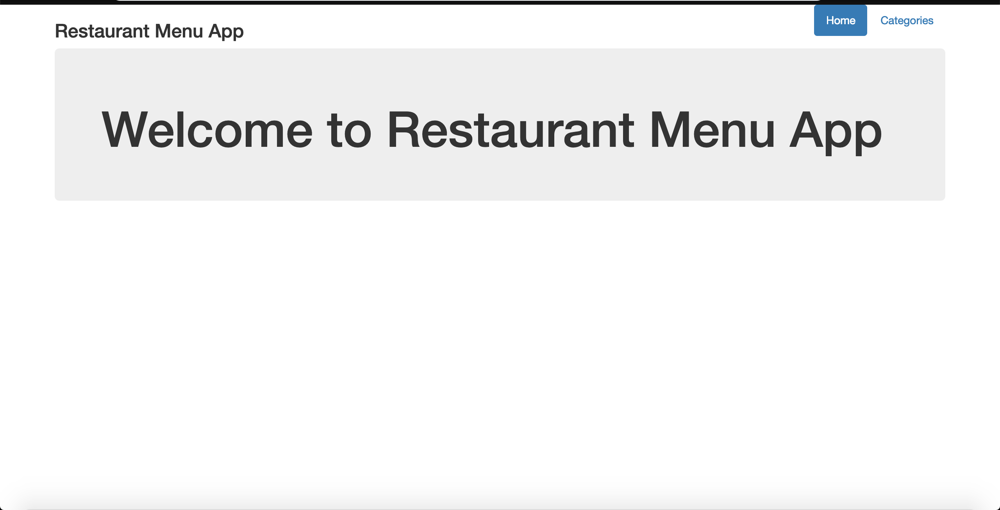
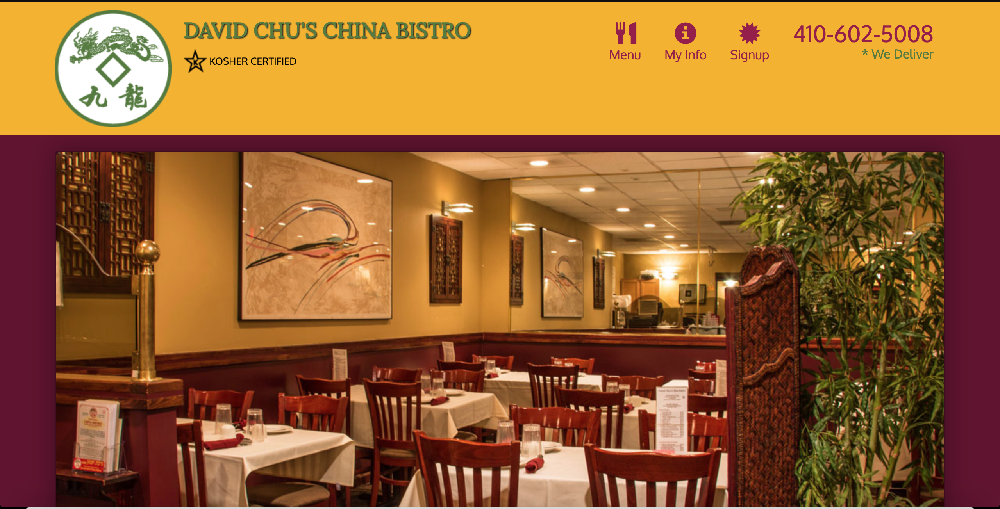

# Course: Single Page Web Applications with AngularJS

This repository contains the answers for the [Single Page Web Applications with AngularJS](https://www.coursera.org/learn/single-page-web-apps-with-angularjs) by Johns Hopkins University (JHU) hosted on [Coursera.org](https://www.coursera.org)

## My submission

### [Week 1](assignments/assignment1/index.html)
_[Source code](assignments/assignment1)_

    

### [Week 2](assignments/assignment2/)
_[Source code](assignments/assignment2)_

    

### [Week 3](assignments/assignment3/)
_[Source code](assignments/assignment3)_

    

### [Week 4](assignments/assignment4/index.html#!/)
_[Source code](assignments/assignment4)_

    

### [Week 5](assignments/assignment5/index.html#/)
_[Source code](assignments/assignment5)_

    

## Customer Website Launched
As part of this course we developed a *real* website for a *real* client. Below is a link to the final product. (*Note*, the site is left without speed optimization to keep it exactly as it was in the course. Site optimization wasn't part of the course).

[David Chu's China Bistro Restaurant in Baltimore, MD](http://www.davidchuschinabistro.com/)
